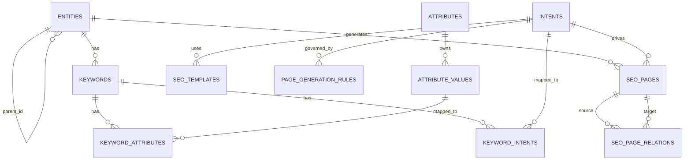

# Enterprise SEO Knowledge Graph Architecture

This document defines the normalized PostgreSQL and NestJS architecture for generating SEO pages from a keyword knowledge graph. It is designed for Arabic ecommerce catalogs where entity taxonomy, reusable attributes, search intent, Shopify inventory, and internal links must be modeled consistently.

## Goals

- Normalize entities, attributes, intents, keywords, templates, rules, generated pages, and link relations.
- Prevent duplicate or cannibalizing pages with a database-level uniqueness lock.
- Support high-read-throughput category, faceted page, and related-link lookups.
- Keep keyword ingestion, page generation, inventory validation, and link recalculation asynchronous.

## PostgreSQL Schema

The executable DDL is stored in [`database/postgres/001_enterprise_seo_knowledge_graph.sql`](../database/postgres/001_enterprise_seo_knowledge_graph.sql). Baseline taxonomy, attributes, intents, rules, and templates are stored in [`database/postgres/002_enterprise_seo_seed.sql`](../database/postgres/002_enterprise_seo_seed.sql).

### Core Tables

| Table                   | Purpose                                                 | Important constraints and indexes                                                                                                             |
| ----------------------- | ------------------------------------------------------- | --------------------------------------------------------------------------------------------------------------------------------------------- |
| `entities`              | Stores domain entities such as categories and products. | Primary key `id`, unique `slug`, `parent_id -> entities(id)`, `idx_entities_slug`, `idx_entities_parent`.                                     |
| `attributes`            | Defines global reusable attribute categories.           | Primary key `id`, unique `name`, `idx_attributes_name`.                                                                                       |
| `attribute_values`      | Stores concrete values for attributes.                  | Primary key `id`, unique `(attribute_id, slug)`, `attribute_id -> attributes(id)`, `idx_attr_values_slug`.                                    |
| `intents`               | Defines the search-intent taxonomy.                     | Primary key `id`, unique `slug`.                                                                                                              |
| `keywords`              | Stores keyword nodes and metrics.                       | Primary key `id`, unique `keyword`, `entity_id -> entities(id)`, `parent_topic_id -> keywords(id)`, `idx_keywords_kw`, `idx_keywords_volume`. |
| `keyword_attributes`    | Maps keywords to many attribute values.                 | Composite primary key `(keyword_id, attribute_value_id)`.                                                                                     |
| `keyword_intents`       | Maps keywords to intent scores.                         | Composite primary key `(keyword_id, intent_id)`, `idx_kw_intents_confidence`.                                                                 |
| `seo_templates`         | Stores generation blueprints per intent.                | `intent_id -> intents(id)`, JSONB `content_structure`.                                                                                        |
| `page_generation_rules` | Stores minimum thresholds before page generation.       | Unique `intent_id`, confidence score check between `0` and `1`.                                                                               |
| `seo_pages`             | Stores generated page output.                           | Unique `slug`, unique `(entity_id, intent_id, attribute_signature)` cannibalization lock.                                                     |
| `seo_page_relations`    | Stores the internal linking graph.                      | Unique `(source_page_id, target_page_id)`, source/target indexes.                                                                             |

### ERD



## Entity Hierarchy

The baseline seed models parent-child category pathing:

- Bedrooms
  - Beds
  - Wardrobes
  - Dressers
  - Dressing Rooms
- Living Rooms
  - Corner Sofas
  - Sofas
  - Salons
  - TV Units
  - Coffee Tables
- Dining Rooms
  - Dining Tables
  - Dining Chairs
- Kids Rooms
- Office Furniture
- Decor & Accessories
  - Carpets
  - Curtains
  - Lighting

## Attribute System

Attributes are decoupled from entities so cross-category modifiers can be reused by clustering and template hydration.

| Attribute | Values                                |
| --------- | ------------------------------------- |
| Style     | Modern, Classic, Neo Classic, Turkish |
| Color     | Beige, Gray, White, Black, Wood       |
| Shape     | L Shape, U Shape, Round, Square       |
| Size      | Small, Medium, Large, King, Queen     |
| Feature   | Storage, Sofa Bed, Expandable         |
| Audience  | Bride, Kids, Teen, Master             |
| Trend     | 2026, New, Latest                     |

## Intent System

| Intent        | Goal                                                             | Template strategy                |
| ------------- | ---------------------------------------------------------------- | -------------------------------- |
| Commercial    | High buying intent, such as `Buy Corner Sofa` or price searches. | Standard category / PLP.         |
| Transactional | Exact model or SKU searches.                                     | SKU/product landing experience.  |
| Gallery       | Visual inspiration, such as `Pictures of Modern Sofas`.          | Image-heavy grid.                |
| Comparison    | Evaluation queries, such as `Best Corner Sofa`.                  | Pros/cons and comparison tables. |
| FAQ           | Question-based searches.                                         | Accordion UI with schema markup. |
| Trend         | Time-sensitive searches such as `Latest Bedroom Designs 2026`.   | Annual refresh workflow.         |
| Guide         | Deep informational searches.                                     | Long-form guide content.         |
| Inspiration   | Broader ideation searches.                                       | Editorial inspiration hub.       |
| Local         | Geo-targeted searches.                                           | Location landing pages.          |

## Keyword Knowledge Graph

Every keyword is resolved into:

```text
Keyword -> Entity + Attribute Values[] + Intent + Metrics
```

Example:

| Processing step      | Result                                                           |
| -------------------- | ---------------------------------------------------------------- |
| Raw keyword          | `صور ركنات مودرن 2026`                                           |
| Entity resolution    | `Corner Sofas`                                                   |
| Attribute resolution | `Style: Modern`, `Trend: 2026`                                   |
| Intent resolution    | `Gallery`                                                        |
| Metrics injection    | Volume `2400`, difficulty `12`                                   |
| Graph output         | keyword node linked to entity, attributes, and intent confidence |

## SEO Page Generation Engine

1. **Ingestion**: Load keywords from CSV/API exports into the graph.
2. **Clustering**: Group keywords by identical `(entity, sorted attribute values, intent)`.
3. **Primary keyword selection**: Select the highest-volume keyword for the URL slug and template variables.
4. **Rule validation**: Apply `page_generation_rules` for volume, inventory, and confidence thresholds.
5. **Hydration**: Fetch matching Shopify products by entity and attributes.
6. **Template execution**: Render `seo_templates` with the primary keyword, entity, attributes, and products.
7. **Publishing**: Insert/update `seo_pages`, then enqueue internal-link recalculation.

### Cannibalization Prevention

The page engine must generate an `attribute_signature` from:

```text
md5(entity_id + ':' + intent_id + ':' + sorted(attribute_value_ids).join(','))
```

The `seo_pages` table enforces `UNIQUE(entity_id, intent_id, attribute_signature)`. If `Modern Sofa` and `Sofa Modern` resolve to the same signature, they are merged into one page cluster instead of creating duplicate URLs.

## Page Creation Rules

| Intent     | Min volume | Min products | Min intent confidence |
| ---------- | ---------: | -----------: | --------------------: |
| Commercial |         50 |            4 |                   85% |
| Gallery    |        100 |    10 images |                   90% |
| Comparison |         20 | 2 categories |                   80% |
| Trend      |         10 |            6 |                   95% |
| FAQ        |         10 |            0 |                   80% |

Failed clusters should be marked as `Pending Inventory` or `Pending Volume` rather than published.

## Internal Linking Graph

The link graph uses hub-and-spoke rules:

- Gallery pages link to the parent commercial page and one sibling commercial page.
- Comparison pages include direct product links and one winner category commercial link.
- FAQ and guide pages use in-text exact-match anchors to related commercial pages.
- Commercial hub pages link to related gallery, trend, FAQ, and guide pages in a related-searches footer.

## NestJS Target Architecture

```text
src/
├── app.module.ts
├── main.ts
├── config/
│   ├── database.config.ts
│   └── shopify.config.ts
├── core/
│   ├── decorators/
│   ├── filters/
│   ├── guards/
│   └── interceptors/
├── modules/
│   ├── knowledge-graph/
│   │   ├── controllers/
│   │   ├── services/
│   │   ├── repositories/
│   │   ├── entities/
│   │   └── dto/
│   ├── keyword-processor/
│   │   ├── services/
│   │   ├── workers/
│   │   └── dto/
│   ├── page-engine/
│   │   ├── services/
│   │   ├── rules/
│   │   └── entities/
│   ├── link-graph/
│   │   └── services/
│   └── shopify-sync/
│       └── services/
└── shared/
    ├── utils/
    │   └── signature-generator.util.ts
    └── interfaces/
```

### Modules and Services

- `KnowledgeGraphModule`: manages entities, attributes, values, and graph relationships.
- `KeywordProcessorModule`: handles NLP parsing, intent resolution, clustering, and ingestion workers.
- `PageEngineModule`: owns generation state, validation, template execution, and publishing.
- `TemplateModule`: manages CRUD and variable hydration for `seo_templates`.
- `LinkGraphModule`: calculates and persists `seo_page_relations`.
- `ShopifySyncModule`: syncs inventory and validates `min_products` rules.

Key services:

- `GraphTraversalService`: shortest paths and semantic distance between entities.
- `IntentResolverService`: regex, dictionaries, or LLM scoring for intents.
- `CannibalizationGuardService`: signature generation and duplicate-page checks.
- `PageBuilderService`: template hydration plus product injection.

### Queues and Cron Jobs

Use BullMQ queues for expensive workflows:

- `keyword-ingestion-queue`: bulk imports from Ahrefs/Semrush or CSV.
- `page-generation-queue`: sequential cluster-to-page processing to reduce lock contention.
- `link-recalculation-queue`: rebuild affected internal links when a page is added or removed.

Scheduled jobs:

- `InventoryValidatorCron`: runs daily at midnight and unpublishes pages below `min_products`.
- `TrendUpdaterCron`: runs monthly and prepares upcoming-year trend pages, such as `2026 -> 2027`, with 301 redirects for retired URLs.

## Scaling Recommendations

- Keep PostgreSQL JSONB for template structures and moderate graph scale; consider Neo4j when `seo_page_relations` and entity mapping exceed PostgreSQL traversal comfort.
- Use Elasticsearch/OpenSearch for high-volume keyword deduplication and fuzzy matching instead of heavy PostgreSQL `ILIKE` clustering.
- Cache rendered page JSON/HTML in Redis and at the edge, because live Shopify product hydration for long-tail URLs can overload the NestJS event loop.
- Upgrade the `IntentResolverService` from static regexes to a lightweight model/API when Arabic intent ambiguity becomes a quality bottleneck.
